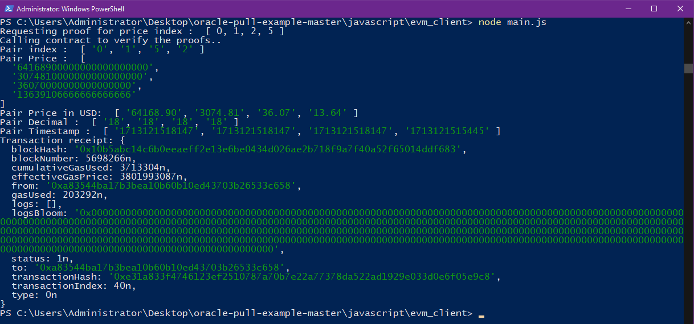

# Javascript PullServiceClient for EVM Readme

Bu kütüphane, bir gRPC sunucusu ile etkileşim kurmak, kanıt verilerini almak ve ardından bu verileri bir blok zincir ağı üzerinde akıllı bir sözleşmeyi çağırmak için tasarlanmıştır. Bu readme dosyası, kütüphaneyi nasıl kullanacağınız ve belirli bileşenleri kendi kullanım senaryonuz için nasıl özelleştireceğiniz hakkında talimatlar içerir.




## Kurulum

PullServiceClient kütüphanesini kullanmak için şu adımları izleyin:

1. Repository'yi klonlayın veya kütüphanenin kaynak kodunu indirin.
2. Proje dizininde aşağıdaki komutu çalıştırarak gerekli bağımlılıkları yükleyin:

   ```bash
   npm install
   ```

# Kullanım

Kütüphane, belirtilen parametreleri kullanarak gRPC sunucusundan kanıt verilerini alan ve ardından bir blok zincir ağındaki bir sözleşme işlevini çağıran main fonksiyonunu sağlar.

# Ayarlar

Kütüphaneyi kullanmadan önce main.js dosyasındaki gerekli ayarlamaları yapmayı unutmayın:

1. gRPC Adresini ayarlayın:

   ```bash
   const address = 'testnet-dora.supraoracles.com';
   ```
2. Almak istediğiniz çiftleri dizi olarak ayarlayın:
(https://gb-docs.supraoracles.com/docs/data-feeds/data-feeds-index)

   ```bash
   const pairIndexes = [0, 21, 61, 49];
   ```

3. Zincir türünü seçin(evm, sui, aptos):

   ```bash
   const chainType = 'evm';
   ```

4. İstenen blok zinciri ağı için RPC URL'sini yapılandırın:

   ```bash
   const web3 = new Web3(new Web3.providers.HttpProvider('<RPC URL>'));
   ```

# Kişiselleştirme


Kullanıcılar akıllı sözleşme etkileşimini callContract fonksiyonu altında özelleştirebilir. Özellikle, aşağıdaki bileşenleri değiştirebilirsiniz:

1. **Smart Contract ABI**: Akıllı sözleşmeniz için ABI JSON dosyasının yolunu güncelleyin.
   ```bash
   const contractAbi = require("../resources/abi.json");
   ```

2. **Smart Contract Address**: Akıllı sözleşme adresinizi ayarlayın:

   ```bash
   const contractAddress = '<CONTRACT ADDRESS>';
   ```

3. **Function Call**: 
Akıllı sözleşmeniz yöntemlerine göre işlev çağrısını değiştirin. Örneğin, akıllı sözleşmenizde GetPairPrice adında bir yöntem varsa:
   ```bash
   const txData = contract.methods.GetPairPrice(hex, 0).encodeABI();
   ```

4. **Gas Estimate**: İşlem için gereken gas miktarını, çağrılmak istenen sözleşme yöntemini çalıştırarak hesaplayın:
   ```bash
   const gasEstimate = await contract.methods.GetPairPrice(hex, 0).estimateGas({ from: "<WALLET ADDRESS>" });
   ```

5. **Transaction Object**: İhtiyacınıza göre transaction object'i özelleştirin:
   ```bash
   const transactionObject = {
    from: "<WALLET ADDRESS>",
    to: contractAddress,
    data: txData,
    gas: gasEstimate,
    gasPrice: await web3.eth.getGasPrice() // Set your desired gas price here, e.g: web3.utils.toWei('1000', 'gwei')
   };
   ```

6. **Private Key Signing**: Uygun özel anahtarla işlemi imzalayın:
   ```bash
   const signedTransaction = await web3.eth.accounts.signTransaction(transactionObject, "<PRIVATE KEY>");
   ```

# Çalıştırma

Uygulamayı çalıştırmak için aşağıdaki komutu girin:

```bash
node main.js
```

Sağlanan konfigürasyon ve özelleştirmelere göre, bu işlem kanıt verilerinin alınmasını ve akıllı sözleşme ile etkileşimi başlatacaktır.
